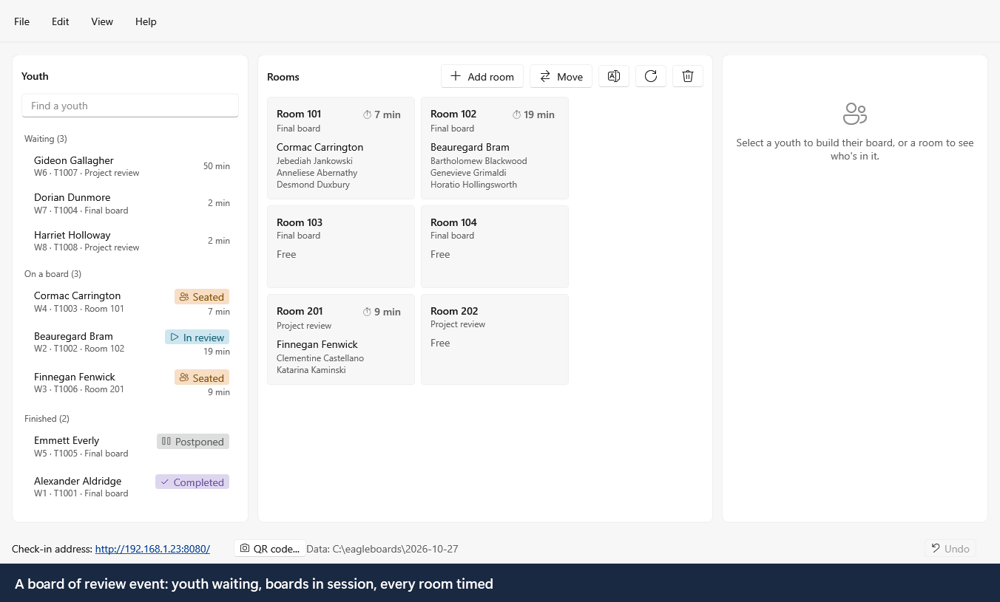
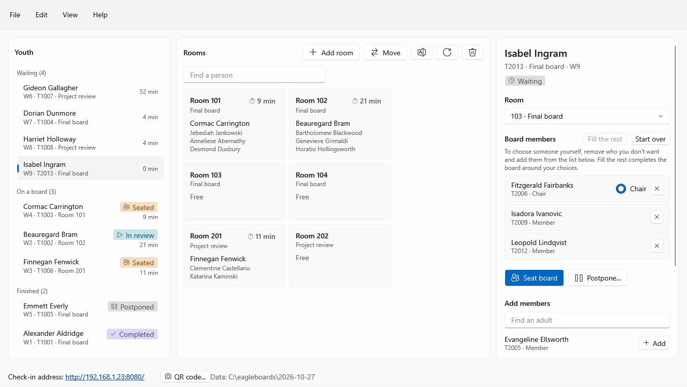
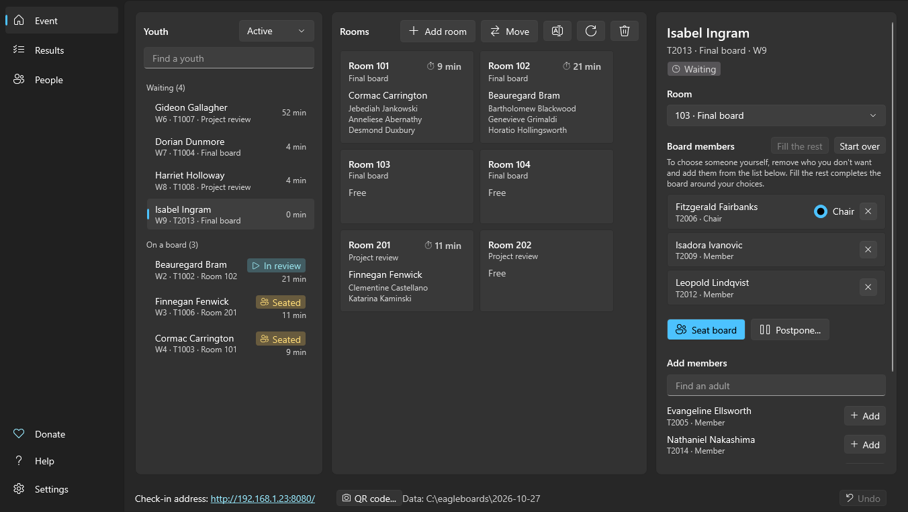

# Eagle Board Scheduler for Windows

**Check-in and room scheduling for Eagle Scout board of review events.**
Youth and adults sign themselves in on a tablet; the person running the event
seats boards in a few clicks, with every Guide to Advancement rule checked
before anyone sits down, and sees every room's time at a glance.

<picture>
  <source media="(prefers-color-scheme: dark)" srcset="docs/images/scheduler-demo-dark.gif">
  
</picture>

<sub>Every name in these images is made up. The demo is rendered by `tests/EagleBoards.UiSnapshots` from synthetic data.</sub>

## What it does

- **Sign-in on any tablet, phone or laptop.** Stations open a web page on the
  venue Wi-Fi; nothing to install on them. A sign-in appears on the admin
  computer at once, matched to its pre-registration when there is one.
- **A board proposed for you.** Select a waiting youth and the scheduler
  suggests a free room of the right type, a qualified chair, and members from
  other units. Take it, or change anything: pick someone yourself and
  **Fill the rest** completes the board around them.
- **Rules checked as you build, not after.** Board size (3 to 6 for a board of
  review), a qualified chair, nobody on two boards or gone home, and the
  council's same-unit rule, with the national floor enforced when you
  override it. Problems are listed above the Seat button, in plain words,
  and a warning mark follows the name of anyone from the youth's own unit
  (a Wood Badge pentagon marks those counting the event toward Wood Badge).
- **Every room timed.** Convening, in review, running long, overdue. Times
  follow the Guide to Advancement and can be changed in Settings.
- **Where everyone is.** Type anyone's name over the rooms, youth or adult,
  and see which room they're in, or that they're waiting, free or gone home.
  Each youth's leader and parents, and which room
  they're in, for fetching them and for afterwards.
- **Results and a report.** Every board and its result, saved to a CSV file
  for Excel.
- **A Windows 11 app.** Light and dark mode, your accent colour, usable
  from the keyboard, with controls labelled for screen readers. Runs on
  Windows 10 too.
- **Your data stays on your computer.** Plain CSV files in a folder you
  choose, nothing sent anywhere. (Optional: import the event's sign-ups from
  SignUpGenius.)

| Light | Dark |
|---|---|
|  |  |

## Getting it

Download `EagleBoards.exe` from
[**Releases**](https://github.com/deekayen/eagleboards-windows/releases). It's
one file with its own .NET runtime: nothing to install. The version is in
**File › Settings**. The exe isn't code-signed yet, so the first time Windows
may say it *protected your PC*: choose **More info**, then **Run anyway**.

**Requirements.** Windows 11 on the admin computer. Windows 10 (22H2) should
work too, without Windows 11's translucent window background; please report
anything that doesn't. The check-in stations only need a web browser.

## Running an event

1. Put `EagleBoards.exe` anywhere (for example in the data folder,
   `C:\eagleboards`) and double-click it.
2. The start-up window asks for:
   - **Data folder**: holds `config.properties`, the adult history
     (`Master_AdultHistory.csv`), and one folder per event named by its date.
     A new folder gets a commented `config.properties`; a missing adult
     history can be started empty.
   - **Event date**: defaults to today; each event gets its own `YYYY-MM-DD`
     folder.
   - **Check-in network**: the venue Wi-Fi. Serving only that network keeps
     the site off Hyper-V, WSL and VPN adapters. "All networks" is there too.
   - **Port** (8080).
   - **SignUpGenius API key**, and whether to **import the event's
     sign-ups**. The key is kept for your Windows account in the registry
     (`HKEY_CURRENT_USER\Software\Eagle Boards`), encrypted so only that
     account can read it, and never in the data folder. Paste it once; it's
     there the next time. Empty the box and start to remove it. (The Java
     version's launcher still reads its own key from a `.env` file.)
3. Press **Start**. The first time, Windows Firewall asks whether to allow the
   scheduler on the network: allow **private** networks, or the stations can't
   connect.
4. Point each check-in station's browser at the check-in address at the
   bottom of the window (right-click it to copy), e.g. `http://192.168.1.23:8080`.
5. Add rooms with **Add room** and run the event from the **Event** page.
   **Help › Eagle Boards help** (F1) walks through seating, starting and
   completing boards. The menu bar has the rest: **View** switches to a page
   for each table (Results, Adults, Youth, Pre-registered, Adult history
   CSV, Rooms; Ctrl+2 to 7), each one editable where it is but the adult
   history, and to **Approved proposals** (Ctrl+8), the project proposals
   approved at earlier events in the data folder, for a youth who comes
   without the signed page. **File** has Save report, the check-in QR code
   and Settings.
   An adult who would rather not use the tablet is signed in with **Add
   adult** on the Adults page.

Closing the scheduler stops the check-in site. Everything is saved as it
happens; there is no "save" step.

### Command line

The app accepts the Java jar's options, so an existing launcher keeps working
and skips the start-up window:

```bat
EagleBoards.exe -d 2026-09-22 -a Master_AdultHistory.csv -c config.properties -port 8080 -bind 192.168. -sugkey %SUG_KEY%
```

`-d` data folder for the event · `-a` adult history · `-c` config · `-p`
district pre-registration CSV · `-sugkey`/`-sugid` SignUpGenius · `-port` ·
`-bind` IPv4 prefix to serve on (`127.0.0.1` keeps it off the network) · `-v`
verbose log. `EagleBoards.Server` (for tests, or a machine with no desktop)
takes the same options and runs the check-in site with no window.

If the `-a` file isn't there yet (a new install), a new, empty adult history is
started at that path, and its full path is written to the log (`eagleboards.log`
in the event's folder; the console for `EagleBoards.Server`). A start that
fails exits with code 1.

## Support this project

The scheduler is free, and built and kept up by a volunteer. If it helps your
district's board events, you can chip in:
[GitHub Sponsors](https://github.com/sponsors/deekayen) ·
[Ko-fi](https://ko-fi.com/deekayen) ·
[Liberapay](https://liberapay.com/deekayen) ·
[PayPal](https://paypal.me/deekayen) ·
[Venmo](https://venmo.com/drdnorman) ·
[Buy Me a Coffee](https://buymeacoff.ee/deekayen).
The same links are in the app, under **Help › Donate**.

## How it's built

This is the Windows version of the Java
[Eagle Board Scheduler](https://github.com/deekayen/eagleboards-java) (itself
reconstructed from an inherited binary). The rules and server were ported to
C#; the check-in pages are the same; the Java version's browser admin pages
are replaced by a native WPF app using Windows' Fluent theme. It reads and
writes the **same data files** as the Java version, so an existing data
folder keeps working and either version can pick up where the other left off
if one crashes mid-event (`scripts/test-handoff.sh` checks both directions).
Just never run both at once: they would fight over the port and the files.

```
  Check-in stations (any browser)             Admin computer
     /  /youth_register  /adult_register      EagleBoards.exe
              |                                 |  Menu bar; Event, Results
              |  HTTP, venue network            |  and Adults pages
              +---------------> Kestrel <-------+  (in-process, no browser)
                                   |
                              BoardService  --  CSV files in the data folder
```

### What's different from the Java version

Deliberate changes. The server-side ones each have a unit test in
`tests/EagleBoards.Tests`:

- **The admin side is a Windows app.** `/scheduler`, `/admin`, `/configure`
  and `/help` are gone from the website. A sign-in in the browser shows up in
  the scheduler immediately rather than at the next poll. Boards are built in
  one pane with every rule listed as you go, instead of a pop-up per problem.
- **Stations can only check in.** The endpoints the old admin pages used
  (seat, complete, record edits, room changes, settings) still exist with the
  same wire formats, but answer only requests from the admin computer itself.
  From the network, the youth and adult lists return names and units only,
  never phones or emails.
- **Seating is stricter where the old checks had gaps.** One adult listed
  twice no longer counts as two members, and an adult marked Unavailable for
  that board type is refused wherever they appear in the list (the browser
  only checked members listed before the chair, the server not at all).
- **Picks are used up by seating.** Seating a board clears its members'
  picks; before, they stayed ticked and blocked auto-select for the next
  youth.
- **Sign-in numbering.** Submitting the sign-in form twice keeps your place
  in the queue instead of renumbering you to the back, and a youth with no
  email is no longer counted as pre-registered because some sign-up also had
  none.
- **SignUpGenius.** Imported adults get their real ID straight away (the Java
  import left them all as `ADULT:::` until a restart, so a sign-in that day
  created a duplicate history record). The API key is never written to the log.
- **Adults' phone numbers** from pre-registration are normalized from their
  digits; the Java code formatted the raw text, so `(555) 123-4567` came out
  garbled. (A youth's isn't imported at all: see Privacy.)
- **Files.** Every save writes a temporary file and swaps it in, so a crash
  can't leave half a file. Old files in the Windows ANSI code page (accented
  names in an adult history from the 2019 build) and files saved by Excel with
  a byte-order mark are read correctly.
- **Status colours** come from the Windows theme instead of `config.properties`;
  the colour keys stay in the file, untouched, for the Java version.
- **HTTP details.** A refused board action is `409` with the reason as text
  (the Java server used `304`, which may not carry a body). Success is still
  `200 OK.`

## Development

```
src/EagleBoards.Core     records, CSV storage, BoardService, BoardCheck (every rule), SignUpGenius
src/EagleBoards.Web      Kestrel check-in server + the embedded check-in pages (wwwroot/)
src/EagleBoards.Server   headless console host (tests, no-desktop use)
src/EagleBoards.App      the WPF admin app (EagleBoards.exe)
tests/EagleBoards.Tests       xUnit: the rule and auto-select cases all three versions share, storage, lifecycle
tests/EagleBoards.Tests/cases those cases, copied from eagleboards-shared (test-cases.lock pins the commit)
tests/EagleBoards.UiSnapshots renders every window off-screen over synthetic data, and the demo GIF
scripts/test-board-event.sh   the Java project's HTTP end-to-end event, run against this server
scripts/test-handoff.sh       the Java and Windows versions taking turns on one event folder
```

```bat
dotnet build -c Release
dotnet test tests/EagleBoards.Tests -c Release
bash scripts/test-board-event.sh
dotnet run --project tests/EagleBoards.UiSnapshots -c Release -- snapshots
dotnet run --project tests/EagleBoards.UiSnapshots -c Release -- snapshots-dark --dark
dotnet run --project tests/EagleBoards.UiSnapshots -c Release -- --demo docs/images
dotnet run --project tests/EagleBoards.UiSnapshots -c Release -- --demo docs/images --dark
```

The last two regenerate the images in this README; run them after a UI change.
`EB_JAR=/path/to/eagleboardscheduler-*.jar bash scripts/test-board-event.sh`
runs the same end-to-end test against the Java server, for comparison, and
`EB_JAR=... bash scripts/test-handoff.sh` has the two versions take turns on
one event folder, as they would if one crashed mid-event.

**Cutting a release.** On GitHub go to **Actions → release → Run workflow**.
That releases `main` as today's date (`v2026.09.22`); type a version to
override it, e.g. `2026.09.22.1` for a second release the same day. Or tag a
commit and push the tag (`git tag v2026.09.22 && git push origin v2026.09.22`).
Either way the workflow builds, runs every test, checks the exe carries no data
files, smoke-tests the exact exe, and only then publishes it with a SHA-256
checksum. The version is stamped in from the tag; there's no file to bump.
Every push to `main` also leaves a build as the **EagleBoards-win-x64**
artifact on its Actions run; use a release for an event.

See [CLAUDE.md](CLAUDE.md) for the working rules (data privacy above all).

## Privacy

The data folder holds personal information about minors, so the app asks for
no more than an event needs: sign-in no longer asks for a youth's birthdate or
phone number, one sent by an older cached page is thrown away, and imports
from pre-registration or SignUpGenius don't keep a youth's number either.
Birthdates and youth phone numbers already in earlier event folders are left as
they are but never shown, pre-filled or exported. Adults' phone numbers are
kept as before. Keep
the folder on the admin computer, out of shared and cloud-synced folders, and
out of git: `.gitignore`
and `scripts/hooks/pre-commit` refuse CSV and spreadsheet files, dated event
folders, the adult history and `.env`. Install the hook once per clone with
`git config core.hooksPath scripts/hooks`.

## License

Apache License 2.0. See [LICENSE](LICENSE) and [NOTICE](NOTICE).

Eagle Scout is a trademark of Scouting America. This project is not affiliated
with or endorsed by Scouting America.
